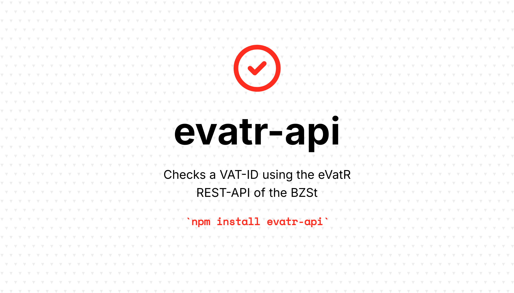

[](https://github.com/rechtlogisch/evatr-js/actions/workflows/run-tests.yml)
[](https://codecov.io/github/rechtlogisch/evatr-js)
[](https://www.npmjs.com/package/evatr-api)

# evatr-api

> Checks a VAT-ID using the eVatR REST-API of the German Federal Central Tax Office (Bundeszentralamt für Steuern, BZSt)

> [!CAUTION]
> This package is in early development and is not yet ready for production use. It is currently being tested and may undergo significant changes.

> [!IMPORTANT]
> This is an unofficial wrapper for the eVatR API. For official documentation and terms of use, please refer to the [German Federal Central Tax Office (BZSt)](https://www.bzst.de/DE/Unternehmen/Identifikationsnummern/Umsatzsteuer-Identifikationsnummer/umsatzsteuer-identifikationsnummer_node.html) website.

> [!NOTE]
> This package uses the new REST-API released in July 2025. The old XML-RPC API is being discontinued and will be sunset on **November 30th, 2025** (based on information from BZSt-Newsletter USTKV 01/2025 dated July 1st, 2025).

## Installation

You can install the package via npm:

```bash
npm install evatr-api
```

## Quick Start

```typescript
import { EvatrClient } from 'evatr-api';

const client = new EvatrClient();

// Simple validation (only checks if VAT-ID is valid)
const result = await client.validateSimple({
  vatIdOwn: 'DE123456789',
  vatIdForeign: 'ATU12345678'
});

console.log(result);
```

or

```typescript
// Qualified validation with company data
const result = await client.validateQualified({
  vatIdOwn: 'DE123456789',
  vatIdForeign: 'ATU12345678',
  company: 'Musterhaus GmbH & Co KG',
  location: 'musterort'
});

console.log(result);
```

> [!TIP]
> You might want to take a look at some [examples](./examples/).

## Status Codes

The API returns various status codes. You can check the status using the client methods:

```typescript
const result = await client.validateSimple({ /* ... */ });

client.isSuccessStatus(result.status);  // true for valid VAT-IDs
client.isErrorStatus(result.status);    // true for errors
client.isWarningStatus(result.status);  // true for warnings

// Get human-readable message
const message = client.getStatusMessage(result.status);
console.log(message?.message); // Message in German
```

## API Reference

### Constructor

```typescript
const client = new EvatrClient(config?: EvatrClientConfig);
```

**Configuration Options:**
- `timeout?: number` - Request timeout in milliseconds (default: 30000 ms; = 30 s)
- `headers?: Record<string, string>` - Custom headers to include with requests

### Methods

#### Simple Validation

Validates only the VAT-ID without company data verification:

```typescript
await client.validateSimple({
  vatIdOwn: 'DE123456789',     // Your German VAT-ID (required)
  vatIdForeign: 'ATU12345678', // VAT-ID to validate (required)
  includeRaw: true,            // Include raw response (optional)
});
```

#### Qualified Validation

Validates VAT-ID and verifies company data:

```typescript
await client.validateQualified({
  vatIdOwn: 'DE123456789',            // Your German VAT-ID (required)
  vatIdForeign: 'ATU12345678',        // VAT-ID to validate (required)
  company: 'Musterhaus GmbH & Co KG', // Company name (required)
  location: 'musterort',              // City (required)
  street: 'Musterstrasse 22',         // Street address (optional)
  zip: '12345',                       // Postal code (optional)
  includeRaw: true,                   // Include raw response (optional)
});
```

> [!TIP]
> You may set `true` as the second parameter to get an [`ExtendedResponse`](#extended-response) object.

#### Utility Methods

```typescript
// Get status messages
const statusMessages = await client.getStatusMessages();

// Get availability map by EU member state (alpha-2 code -> boolean)
const availability = await client.getAvailability();
const isGermanyAvailable = availability.DE === true;

// Get content of specific status message
const message = client.getStatusMessage('evatr-0000');

// Check status types
client.isSuccessStatus('evatr-0000'); // true
client.isErrorStatus('evatr-0004');   // true
client.isWarningStatus('evatr-2002'); // true
```

### Request

The API uses German terms, which have been mapped to the following English parameters:

| BZSt API          | evatr-api      |
|-------------------|----------------|
| anfragendeUstid   | vatIdOwn       |
| angefragteUstid   | vatIdForeign   |
| firmenname        | company        |
| ort               | location       |
| strasse           | street         |
| plz               | zip            |

### Response

All validation methods return a `Response` object by default:

```typescript
interface Response {
  id: string;                // Technical request ID returned by the API, related to the request
  timestamp: string;         // Query timestamp (ISO string)
  status: string;            // Status code (e.g., "evatr-0000")
  vatIdOwn: string;          // Normalized own VAT-ID used for API request
  vatIdForeign: string;      // Normalized foreign VAT-ID used for API request
  validFrom?: string;        // Valid from date (ISO string)
  validTill?: string;        // Valid until date (ISO string)
  company?: QualifiedResultCode;  // Company name validation result
  street?: QualifiedResultCode;   // Street validation result
  zip?: QualifiedResultCode;      // ZIP code validation result
  location?: QualifiedResultCode; // Location validation result
  raw?: string;                // Raw response from API (only if includeRaw is true)
}
```

The API uses German terms, which have been mapped to the following English parameters:

| BZSt API        | evatr-api     |
|-----------------|---------------|
| id              | id            |
| anfrageZeitpunkt| timestamp     |
| status          | status        |
| gueltigAb       | validFrom     |
| gueltigBis      | validTill     |
| ergFirmenname   | company       |
| ergStrasse      | street        |
| ergPlz          | zip           |
| ergOrt          | location      |

#### Extended Response

By passing `true` as the second parameter to function `validateSimple({...}, true)` or `validateQualified({...}, true)` an `ExtendedResponse` object is returned. It maps date strings to Date objects, adds convenience fields `valid` and `message`, and provides a `timestamp` object with both the original string and a parsed Date:

```typescript
interface ExtendedResponse {
  id: string;                      // Technical request ID returned by the API, related to the request
  timestamp: Timestamp;            // Timestamp object with original string and Date object
  valid: boolean;                  // true if isSuccessStatus()
  status: string;
  message?: string;                // German description for the status
  vatIdOwn: string;                // Normalized own VAT-ID used for API request
  vatIdForeign: string;            // Normalized foreign VAT-ID used for API request
  validFrom?: Date;                // Date object
  validTill?: Date;                // Date object
  company?: QualifiedResultCode;
  street?: QualifiedResultCode;
  zip?: QualifiedResultCode;
  location?: QualifiedResultCode;
  raw?: string;
}
```

### Validation Results (Qualified Validation)

For qualified validation, the response includes validation results for each field:

- **A** - Data matches registered information
- **B** - Data does not match registered information  
- **C** - Data was not requested
- **D** - Data not provided by the EU member state

## Utility Functions

The library includes helpful utility functions via `EvatrUtils`:

```typescript
import { EvatrUtils } from 'evatr-api';

// Validate VAT-ID format
EvatrUtils.checkVatIdSyntaxForCountry('DE123456789', 'DE'); // true

// Get country information
EvatrUtils.getCountryName('DE'); // 'Germany'
EvatrUtils.isEUMemberState('DE'); // true

// Check validation capability
EvatrUtils.canValidate('DE123456789', 'ATU12345678'); // true
EvatrUtils.canValidate('DE123456789', 'DE987654321'); // false (can't validate DE->DE)

// Get test VAT-IDs for development
const testIds = EvatrUtils.getTestVatIds();
```

## Migration Helper (Backward Compatibility)

For users migrating from the [evatr](https://github.com/qqilihq/evatr) library, we provide a migration helper that maintains API compatibility.

> [!IMPORTANT]
> The migration helper was introduced because the German Federal Central Tax Office is **sunsetting the XML-RPC API on November 30th, 2025**. This helper allows existing code to work with minimal changes while using the new REST API under the hood.

### Why the Migration Helper?

The new REST API has several differences from the XML-RPC API:
- JSON responses instead of XML
- Different parameter names
- Different response structure
- Different error codes and messages
- There is no standard yet on English naming conventions for request and response parameters in context of VAT-ID validation

### Usage

```typescript
import { EvatrMigrationHelper as evatr } from 'evatr-api';

// Simple validation (matches original evatr API)
const result = await evatr.checkSimple({
  ownVatNumber: 'DE123456789',
  validateVatNumber: 'ATU12345678'
});

// Qualified validation (matches original evatr API)
const qualifiedResult = await evatr.checkQualified({
  ownVatNumber: 'DE123456789',
  validateVatNumber: 'ATU12345678',
  companyName: 'Musterhaus GmbH & Co KG',
  street: 'Musterstrasse 22',
  zip: '12345',
  city: 'musterort',
});
```

### Breaking Changes

While the migration helper tries to maintain API compatibility, there are some unavoidable breaking changes:

| Change | evatr | evatr-api |
|--------|---------------|----------------------------------|
| Raw data parameter | `includeRawXml` | `includeRaw` |
| Raw data response | `rawXml` (XML string) | `raw` (JSON string) |
| Error codes | XML-RPC specific codes | Mapped to legacy codes (best effort) |
| Error descriptions | Based on error code | Based on REST API status messages |
| Additional field | - | `status` (new REST API status code) |

> [!NOTE]
> API status codes have been [mapped](./src/migration-helper.ts#L33) to legacy codes to the best of our knowledge. If an API status does not correspond to a legacy code, the 999 legacy code is being returned. We recommend to relay on API status.

> [!TIP]
> See the [migration helper example](./examples/migration-helper.ts) for a complete usage demonstration.

### Mapping

The following tables show the parameter naming mapping between [evatr](https://github.com/qqilihq/evatr) and [evatr-api](https://github.com/rechtlogisch/evatr-js):

#### Request

| evatr                   | evatr-api                    |
|-------------------------|------------------------------|
| `ownVatNumber`          | `vatIdOwn`                   |
| `validateVatNumber`     | `vatIdForeign`               |
| `companyName`           | `company`                    |
| `city`                  | `location`                   |
| `street`                | `street`                     |
| `zip`                   | `zip`                        |
| `includeRaw`            | `includeRaw`                 |

#### Response

| evatr                          | evatr-api                               |
|--------------------------------|-----------------------------------------|
| `raw` (XML)                    | `raw` (JSON)                            |
| `date`                         | `timestamp` {0, 10} (format YYYY-MM-DD) |
| `time`                         | `timestamp` {11, 8} (format HH:MM:SS)   |
| `errorCode`                    | - (replaced by `status`)                |
| `errorDescription`             | - (use getStatusMessage() or `message` in ExtendedResponse) |
| - (exists in migration helper) | `status`                                |
| `ownVatNumber`                 | `vatIdOwn`                              |
| `validatedVatNumber`           | `vatIdForeign`                          |
| `validFrom`                    | `validFrom`                             |
| `validTill`                    | `validTill`                             |
| `valid`                        | `valid`                                 |
| `resultName`                   | `company`                               |
| `resultCity`                   | `location`                              |
| `resultStreet`                 | `street`                                |
| `resultZip`                    | `zip`                                   |
| `resultNameDescription`        | - (use explainQualifiedResultCode())    |
| `resultCityDescription`        | - (use explainQualifiedResultCode())    |
| `resultStreetDescription`      | - (use explainQualifiedResultCode())    |
| `resultZipDescription`         | - (use explainQualifiedResultCode())    |


## Error Handling

The library throws `EvatrApiError` for API-related errors:

```typescript
try {
  const result = await client.validateSimple({
    anfragendeUstid: 'DE123456789',
    angefragteUstid: 'INVALID'
  });
} catch (error) {
  if (error.name === 'EvatrApiError') {
    console.log('Status:', error.status);
    console.log('HTTP Code:', error.http);
    console.log('Field:', error.field);
    console.log('Message:', error.message);
  }
}
```

## API Updates

The library includes utilities to check for API updates:

```bash
# Check for all updates
npm run update:api check

# Check only API documentation
npm run update:api api-docs

# Check only status messages
npm run update:api status-messages
```

### Update Workflow

1. **Check for updates**: Run `npm run update:api check` to see if there are new versions
2. **Inspect output**: Status message changes are displayed with added, removed, and modified messages
3. **Compare differences**: Compare current file with updated versions using for example `diff`, New files are saved with timestamps (e.g., `statusmeldungen-2025-08-01.json`)
4. **Update constants**: Update the TypeScript constants file with new messages:

```bash
npm run update:api update-constants ./docs/statusmeldungen-2025-08-01.json
```

## Rate Limits and Best Practices

- The BZSt API has rate limits for qualified validation requests
- Add delays between requests when validating multiple VAT-IDs
- Cache results when possible to avoid unnecessary API calls (for example for 12 hours)
- Handle errors gracefully and provide meaningful feedback to users

## Testing

```bash
npm test
```

### Dummy data

The library includes test VAT-IDs and information that can be used for testing. These are official test VAT-IDs provided by the API documentation:

```typescript
const testRequest = {
  anfragendeUstid: 'DE123456789',
  angefragteUstid: 'ATU12345678',
};

const qualifiedTestRequest = {
  anfragendeUstid: 'DE123456789',
  angefragteUstid: 'ATU12345678',
  firmenname: 'Musterhaus GmbH & Co KG',
  strasse: 'Musterstrasse 22',
  plz: '12345',
  ort: 'musterort',
};
```

## Changelog

Please see [Release Notes](../../releases) for more information on what has changed recently.

## Contributing

Please see [CONTRIBUTING](.github/CONTRIBUTING.md) for details.

## Security Vulnerabilities

If you discover any security-related issues, please email [open-source@rechtlogisch.de](mailto:open-source@rechtlogisch.de) instead of using the issue tracker.

## Credits

- [Krzysztof Tomasz Zembrowski](https://github.com/zembrowski)
- [All Contributors](../../contributors)

## License

The MIT License (MIT). Please see [License File](LICENSE.md) for more information.
